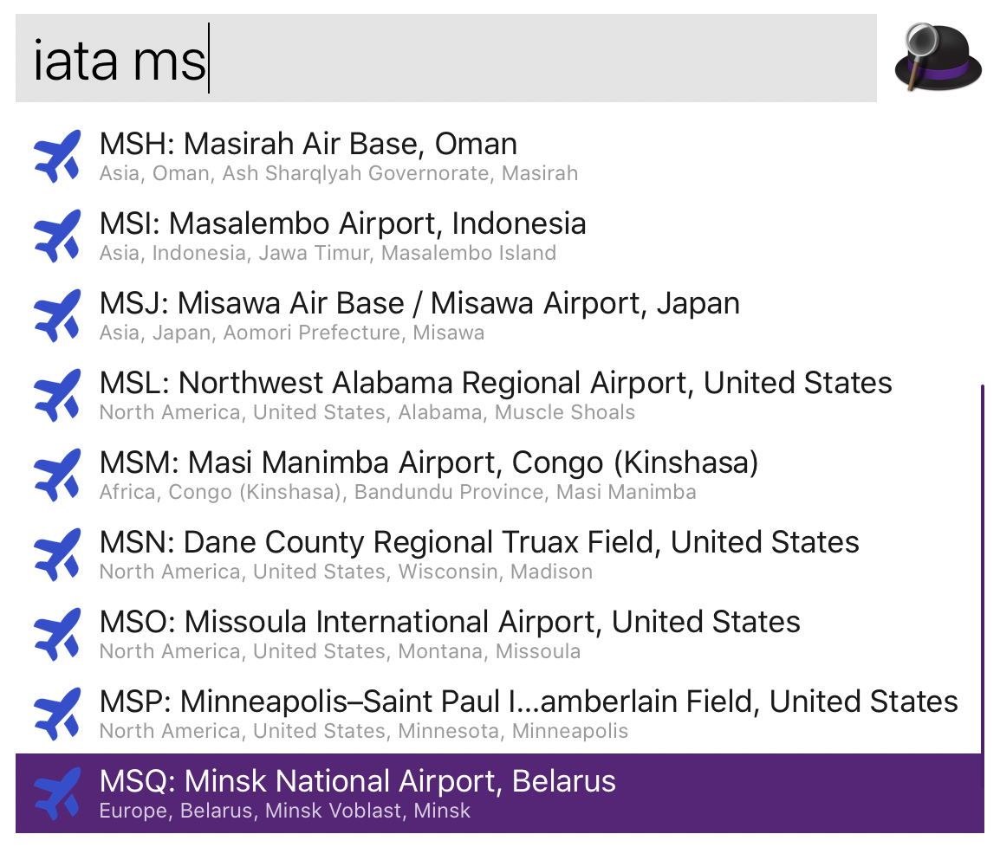

# airports-alfred
Workflow for Alfred app to get info and location of an airport by IATA code.

Example:


Google maps with located airport will be opened by click.

Download: [Airports.alfredworkflow](Airports.alfredworkflow)


---
It also can be used via cli:
```bash
./describe-airports.sh ms
MSA: Muskrat Dam Airport, North America, Canada, Ontario, Muskrat Dam
MSE: Kent International Airport, Europe, United Kingdom, England, Manston
MST: Maastricht Aachen Airport, Europe, Netherlands, Limburg, Maastricht
MSX: Mossendjo Airport, Africa, Congo (Brazzaville), Niari Department, Mossendjo
MSZ: Welwitschia Mirabilis International Airport, Africa, Angola, Namibe Province, Moçâmedes
MSU: Moshoeshoe I International Airport, Africa, Lesotho, Maseru, Maseru
MSM: Masi Manimba Airport, Africa, Congo (Kinshasa), Bandundu Province, Masi Manimba
MSW: Massawa International Airport, Africa, Eritrea, Semenawi Keyih Bahri, Massawa
MSI: Masalembo Airport, Asia, Indonesia, Jawa Timur, Masalembo Island
MSD: Mount Pleasant Airport, North America, United States, Utah, Mount Pleasant
MSC: Falcon Field, North America, United States, Arizona, Mesa
MSL: Northwest Alabama Regional Airport, North America, United States, Alabama, Muscle Shoals
MSN: Dane County Regional Truax Field, North America, United States, Wisconsin, Madison
MSO: Missoula International Airport, North America, United States, Montana, Missoula
MSP: Minneapolis–Saint Paul International Airport / Wold–Chamberlain Field, North America, United States, Minnesota, Minneapolis
MSS: Massena International Richards Field, North America, United States, New York, Massena
```

And
```bash
./map-airport.sh msq
https://www.google.com/maps/@?api=1&map_action=map&center=53.882499694824,28.030700683594&zoom=16&basemap=satellite
```
---

Original csv files from [OurAirports.com](https://ourairports.com/data/).

The icon is from [Sergey Chikin set](http://sergeychikin.ru/365/).
